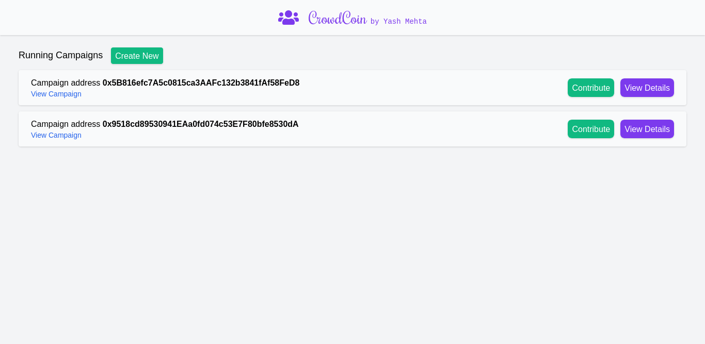
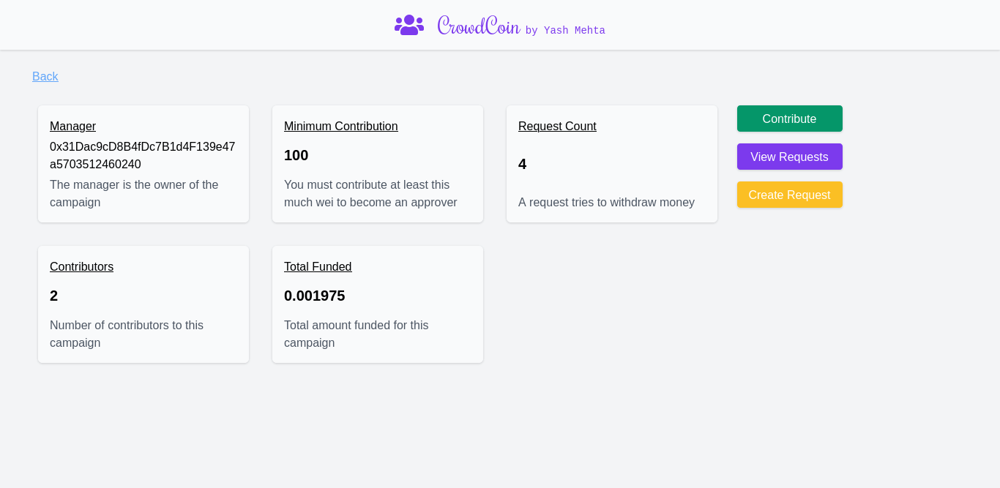
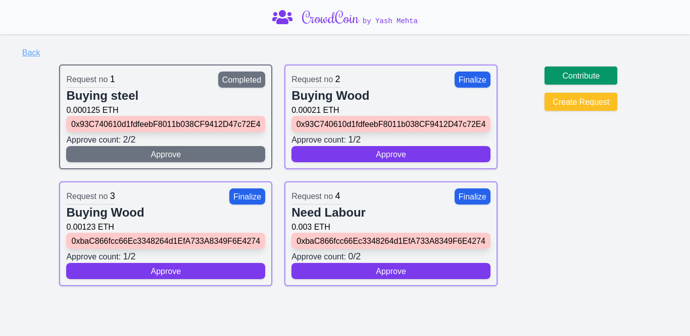

# CrowdCoin
CrownCoin is a crowdfunding dApp, people with a idea can create a campaign, individuals can then contribute to the campaign. Since its decentralized unlike traditional
crowdfunding applications, The campaign creator's transactions are completely transparent and logged onto the site. The campaign owner must also create a request first 
to attempt to transfer money. The contributors will vote on the Request. If a request collects more than 50% votes, It can be finalized by the owner. This decentralized
way of crowdfunding has a higher potential to succeed, and based on transparecy can garner more capital for campaigns.

## How to use
User must have Metamask installed for the dApp to work.

(https://crowd-coiner.vercel.app/)

## Previews

---

---

